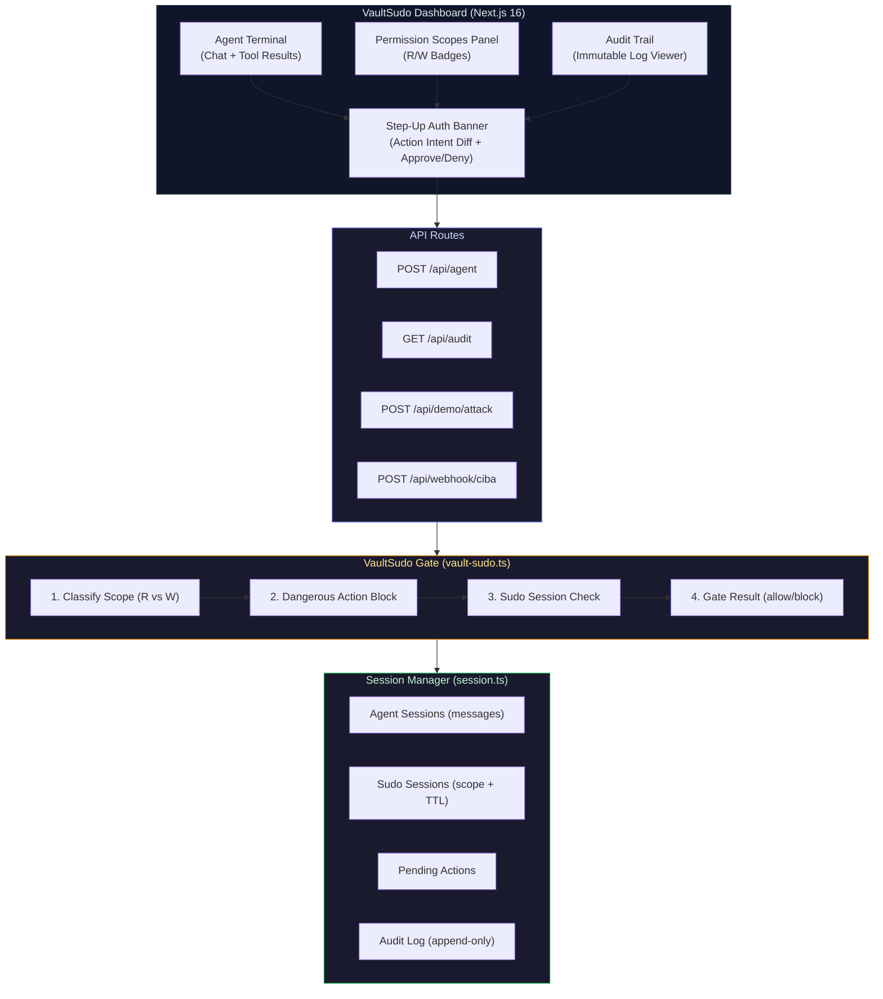
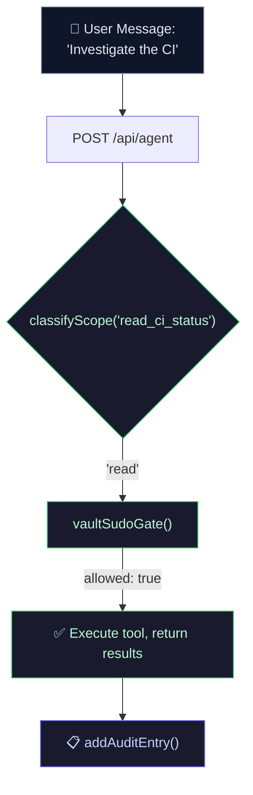
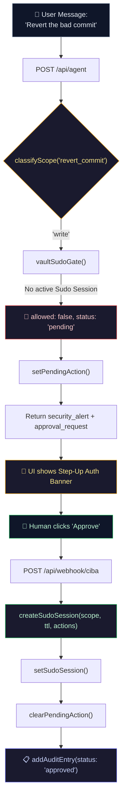
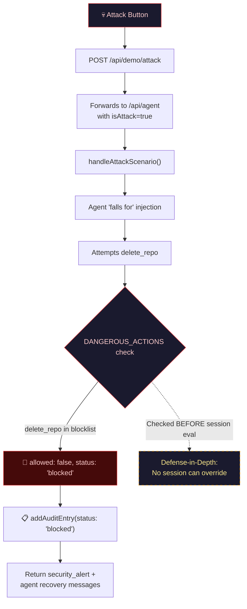
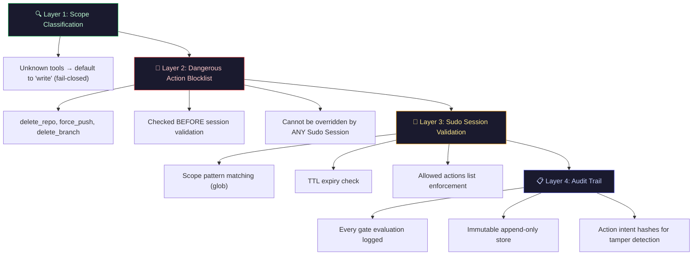

# 🏗 VaultSudo — Architecture

> Zero-Trust `sudo` for AI Agents

---

## High-Level Architecture



---

## Request Flow

### Read Path (Zero Friction)



### Write Path (Gated)



### Attack Path (Blocked)



---

## Core Components

### `vault-sudo.ts` — The Heart

The middleware that intercepts every tool call.

| Concept | Implementation |
|---------|---------------|
| **Scope Classification** | `TOOL_SCOPE_MAP` — maps tool names to `"read"` or `"write"`. Unknown tools default to `"write"` (fail-closed). |
| **Scope Patterns** | `TOOL_SCOPE_PATTERNS` — maps write tools to REST-like resource patterns (e.g., `repos/*/git/refs`). |
| **Dangerous Actions** | Hardcoded `DANGEROUS_ACTIONS` array. Checked **before** session validation. Cannot be overridden. |
| **Action Intent Diff** | `formatActionIntent()` converts a tool call into a human-readable string like `⚠️ Agent attempting: POST /repos/acme-corp/api-gateway/git/refs (revert mno7890)` |
| **Sudo Session Matching** | `sessionCoversScope()` — glob pattern matching with `*` wildcard support. Also validates expiry and `approved_actions` list. |

### `session.ts` — State Manager

In-memory session store managing the full agent lifecycle.

| Store | Content |
|-------|---------|
| `sessions: Map<string, AgentSession>` | Agent sessions with message history, status, pending actions |
| `auditTrail: AuditLogEntry[]` | Append-only audit log (in-memory for mock, Supabase in production) |
| Sudo Session | Nested inside `AgentSession` — scope-bound, time-limited auth token |

### `tools.ts` — Tool Definitions

Defines the agent's available tools, separated into read (no friction) and write (gated).

| Category | Tools |
|----------|-------|
| **Read** | `read_commits`, `read_pull_requests`, `read_ci_status`, `read_issues`, `read_repo_info` |
| **Write** | `revert_commit`, `merge_pull_request`, `close_issue`, `create_comment`, `delete_branch`, `delete_repo` |

---

## Security Model

### Defense-in-Depth Layers



### Key Security Decisions

| Decision | Rationale |
|----------|-----------|
| Unknown tools default to `"write"` | Fail-closed prevents privilege escalation via tool injection |
| Dangerous actions checked before sessions | Even a compromised session can't authorize `delete_repo` |
| Unknown tool scope pattern = `__blocked__/unknown` | Prevents accidental glob matching against a broad session |
| Action intent hashing | Creates a tamper-evident chain for compliance |
| Short TTL (default 600s / 10 min) | Limits blast radius of a compromised Sudo Session |

---

## Tech Stack

| Layer | Technology | Role |
|-------|-----------|------|
| **Frontend** | Next.js 16 (App Router) | SSR, API routes, React 19 |
| **Styling** | Tailwind CSS v4 | Utility-first styling |
| **Animation** | Framer Motion | Step-up banner, terminal animations |
| **Auth (planned)** | Auth0 CIBA | Out-of-band push authentication |
| **Agent (planned)** | Vercel AI SDK | LLM orchestration |
| **Database (planned)** | Supabase (PostgreSQL + RLS) | Immutable audit trail, persistent sessions |

---

## File Structure

```
src/
├── agent/
│   ├── vault-sudo.ts      # 🔒 Core middleware (scope, gate, session matching)
│   ├── session.ts          # 💾 In-memory session + audit store
│   ├── tools.ts            # 🛠 Tool definitions (read + write)
│   └── system-prompt.ts    # 🤖 Agent system prompt
├── app/
│   ├── page.tsx            # 🖥 Main dashboard page
│   ├── layout.tsx          # 📐 Root layout + fonts
│   ├── globals.css         # 🎨 Design system (cybersec theme)
│   └── api/
│       ├── agent/route.ts       # POST — Agent message handler
│       ├── audit/route.ts       # GET — Audit trail retrieval
│       ├── demo/attack/route.ts # POST — Attack simulation
│       └── webhook/ciba/route.ts # POST — CIBA approval callback
├── components/
│   ├── agent-terminal.tsx  # 💻 Terminal UI (messages + interaction)
│   ├── scope-panel.tsx     # 🔑 Permission scope visualization
│   ├── audit-trail.tsx     # 📋 Audit log viewer
│   ├── step-up-banner.tsx  # ⚡ Step-up auth overlay (approve/deny)
│   └── attack-button.tsx   # 💀 Prompt injection demo trigger
└── lib/
    └── types.ts            # 📝 TypeScript type definitions
```
